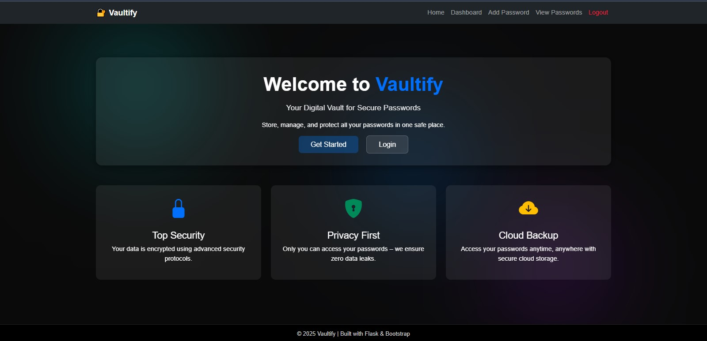

# 🔐 Vaultify - Password Manager

Vaultify is a **secure password manager** built using **Flask**, featuring **AES encryption**, **password strength validation**, a **modern UI**, and an intuitive dashboard to manage your saved credentials.

---

## 🚀 Features
- **Secure AES Encryption** – Protects all your saved passwords.
- **Password Strength Checker** – Ensures strong and safe passwords.
- **Responsive Dashboard** – Clean and modern UI with recent activity tracking.
- **Security Tips** – Regular tips for improving online security.
- **Add & View Passwords** – Save, retrieve, and manage passwords securely.
- **Session-Based Authentication** – Ensures user-specific storage and safety.

---

## 🛠 Tech Stack
- **Backend:** Flask (Python)
- **Frontend:** HTML5, CSS3, Bootstrap 5
- **Database:** MongoDB (or JSON-based storage)
- **Encryption:** Fernet (AES)
- **Other:** Flask Sessions, Jinja2 Templating

---

## 🏠 Home Page Screenshot



---

## ⚙️ Installation

### **1. Clone the repository**
```bash
git clone https://github.com/yourusername/Vaultify-Password-Manager.git
cd Vaultify-Password-Manager
```

## 🔮 Future Enhancements
- 📱 Mobile-friendly UI (PWA support)
- 🔑 Multi-user authentication with OTP-based login
- ☁️ Cloud storage for encrypted vaults
- 🤖 Password generator with AI-based suggestions

## 📝 License
This project is licensed under the MIT License – feel free to modify and use it.

## 👩‍💻 Author
Archi Bansal
4th Year CSE Student, Chandigarh University